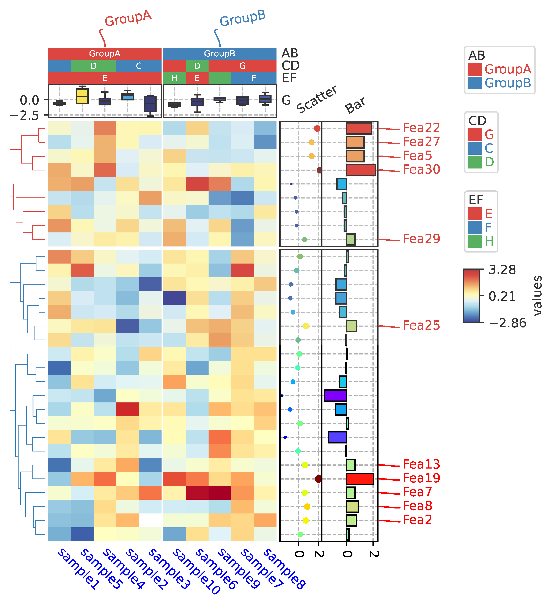

# PyComplexHeatmap [](https://pepy.tech/project/pycomplexheatmap) [](https://pepy.tech/project/pycomplexheatmap) [](https://pepy.tech/project/pycomplexheatmap)
PyComplexHeatmap is a Python package to plot complex heatmap (clustermap). Please click [here](https://dingwb.github.io/PyComplexHeatmap) for documentation.

## Documentation:
----------------------
[https://dingwb.github.io/PyComplexHeatmap](https://dingwb.github.io/PyComplexHeatmap) 
<br><br>
PYPI:
<br>
[https://pypi.org/project/PyComplexHeatmap/](https://pypi.org/project/PyComplexHeatmap/)
<br>

### Wiki
[wiki/layout](../../wiki/Layout/)
<br>
[wiki/Parameters](../../wiki/Parameters/)

## Dependencies:
----------------------
- matplotlib>=3.4.3
- numpy
- pandas
- scipy
```
pip install --ignore-install matplotlib==3.5.1 numpy==1.20.3 pandas==1.4.1
pip install seaborn #only needed when call functions in tools.py
```

## **Installation**
----------------------
1. **Install using pip**:
```shell
pip install PyComplexHeatmap

#upgrade from older version
pip install --upgrade PyComplexHeatmap
```

2. **Install the developmental version directly from github**:
```
pip install git+https://github.com/DingWB/PyComplexHeatmap
```
if you have installed it previously and want to update it, please run 
`pip uninstall PyComplexHeatmap`
and install from github again
OR
```
git clone https://github.com/DingWB/PyComplexHeatmap
cd PyComplexHeatmap
python setup.py install
```

## **Usage**
----------------------
### **1. Simple Guide To Get started.**
```
from PyComplexHeatmap import *

#Generate example dataset (random)
df = pd.DataFrame(['GroupA'] * 5 + ['GroupB'] * 5, columns=['AB'])
df['CD'] = ['C'] * 3 + ['D'] * 3 + ['G'] * 4
df['EF'] = ['E'] * 6 + ['F'] * 2 + ['H'] * 2
df['F'] = np.random.normal(0, 1, 10)
df.index = ['sample' + str(i) for i in range(1, df.shape[0] + 1)]
df_box = pd.DataFrame(np.random.randn(10, 4), columns=['Gene' + str(i) for i in range(1, 5)])
df_box.index = ['sample' + str(i) for i in range(1, df_box.shape[0] + 1)]
df_bar = pd.DataFrame(np.random.uniform(0, 10, (10, 2)), columns=['TMB1', 'TMB2'])
df_bar.index = ['sample' + str(i) for i in range(1, df_box.shape[0] + 1)]
df_scatter = pd.DataFrame(np.random.uniform(0, 10, 10), columns=['Scatter'])
df_scatter.index = ['sample' + str(i) for i in range(1, df_box.shape[0] + 1)]
df_heatmap = pd.DataFrame(np.random.randn(30, 10), columns=['sample' + str(i) for i in range(1, 11)])
df_heatmap.index = ["Fea" + str(i) for i in range(1, df_heatmap.shape[0] + 1)]
df_heatmap.iloc[1, 2] = np.nan

#Annotate the rows with average > 0.3
df_rows = df_heatmap.apply(lambda x:x.name if x.sample4 > 0.5 else None,axis=1)
df_rows=df_rows.to_frame(name='Selected')
df_rows['XY']=df_rows.index.to_series().apply(lambda x:'A' if int(x.replace('Fea',''))>=15 else 'B')

row_ha = HeatmapAnnotation(
                           Scatter=anno_scatterplot(df_heatmap.sample4.apply(lambda x:round(x,2)),
                                            height=12,cmap='jet',legend=False),
                           Bar=anno_barplot(df_heatmap.sample4.apply(lambda x:round(x,2)),
                                            height=16,cmap='rainbow',legend=False),
                           selected=anno_label(df_rows,colors='red',relpos=(-0.05,0.4)),
                           label_kws={'rotation':30,'horizontalalignment':'left','verticalalignment':'bottom'},
                            axis=0,verbose=0)

col_ha = HeatmapAnnotation(label=anno_label(df.AB, merge=True,rotation=10),
                           AB=anno_simple(df.AB,add_text=True),axis=1,
                           CD=anno_simple(df.CD,add_text=True),
                           EF=anno_simple(df.EF,add_text=True,
                                            legend_kws={'frameon':True}),
                           G=anno_boxplot(df_box, cmap='jet',legend=False),
                           verbose=0)

plt.figure(figsize=(5.5, 6.5))
cm = ClusterMapPlotter(data=df_heatmap, top_annotation=col_ha,right_annotation=row_ha,
                       col_cluster=True,row_cluster=True,
                       col_split=df.AB,row_split=2, 
                       col_split_gap=0.5,row_split_gap=0.8,
                       label='values',row_dendrogram=True,
                       show_rownames=False,show_colnames=True,
                       tree_kws={'row_cmap': 'Set1'},verbose=0,legend_gap=5,
                       cmap='RdYlBu_r',xticklabels_kws={'labelrotation':-45,'labelcolor':'blue'})
#plt.savefig("example0.pdf", bbox_inches='tight')
plt.show()
```
### Example output
<p align="center"> 
<a href="https://dingwb.github.io/PyComplexHeatmap/build/html/notebooks/advanced_usage.html#3.-Test-the-row-/-col-orders-&-add-selected-rows-labels">

</a>
</p>

<p align="center">
<a href="https://dingwb.github.io/PyComplexHeatmap/build/html/notebooks/clustermap.html#3.3-Top,-bottom,-left-,right-annotations">

</a>
</p>

<p align="center">
<a href="https://dingwb.github.io/PyComplexHeatmap/build/html/notebooks/advanced_usage.html#Change-orentation-to-the-right">

</a>
</p>
<!--  -->

<p align="center">
<a href="https://dingwb.github.io/PyComplexHeatmap/build/html/notebooks/cpg_modules.html#Plotting-the-Dot-clustermap">

</a>
</p>

<p align="center">
<a href="https://dingwb.github.io/PyComplexHeatmap/build/html/notebooks/composite_heatmaps.html#Composite-two-heatmaps-horizontally-for-mouse-DNA-methylation-array-dataset">

</a>
</p>

## **More Examples**
[https://dingwb.github.io/PyComplexHeatmap/build/html/more_examples.html](https://dingwb.github.io/PyComplexHeatmap/build/html/more_examples.html)


## Call for Contributions
----------------------

The PyComplexHeatmap project welcomes your expertise and enthusiasm!

Small improvements or fixes are always appreciated. If you are considering larger contributions
to the source code, please contact us (ding.wu.bin.gm@gmail.com).

Writing code isn’t the only way to contribute to PyComplexHeatmap. You can also:
- review pull requests
- help us stay on top of new and old issues
- develop tutorials, presentations, and other educational materials
- maintain and improve [our website](https://dingwb.github.io/PyComplexHeatmap)
- develop graphic design for our brand assets and promotional materials
- translate website content
- help with outreach and onboard new contributors
- put forward some new ideas about update.
