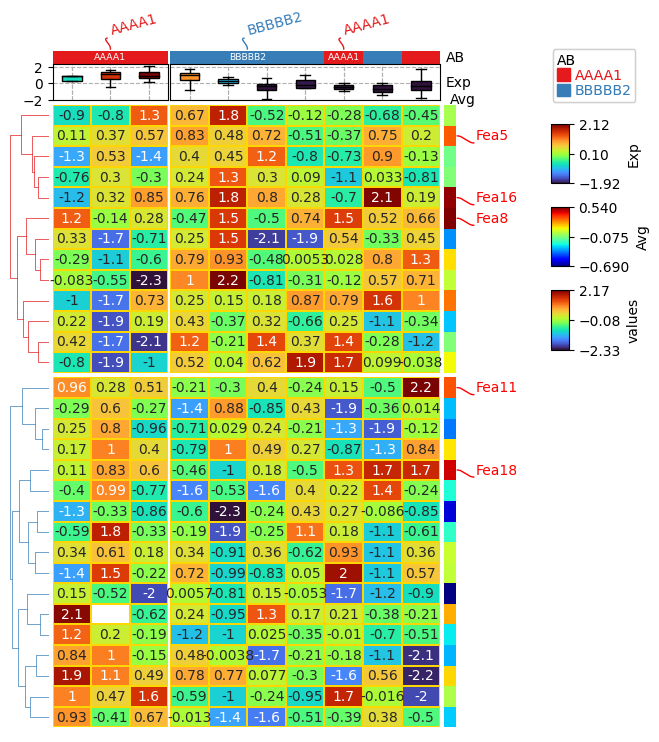
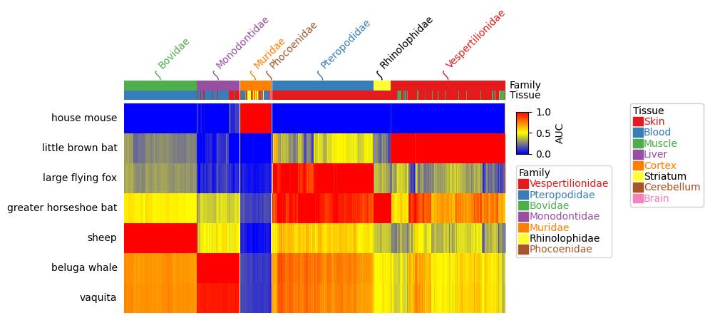
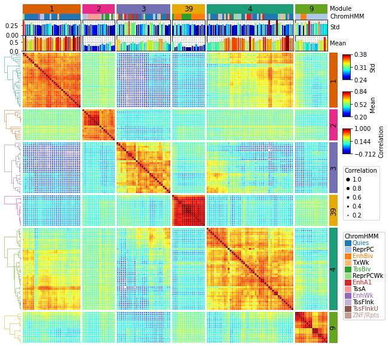
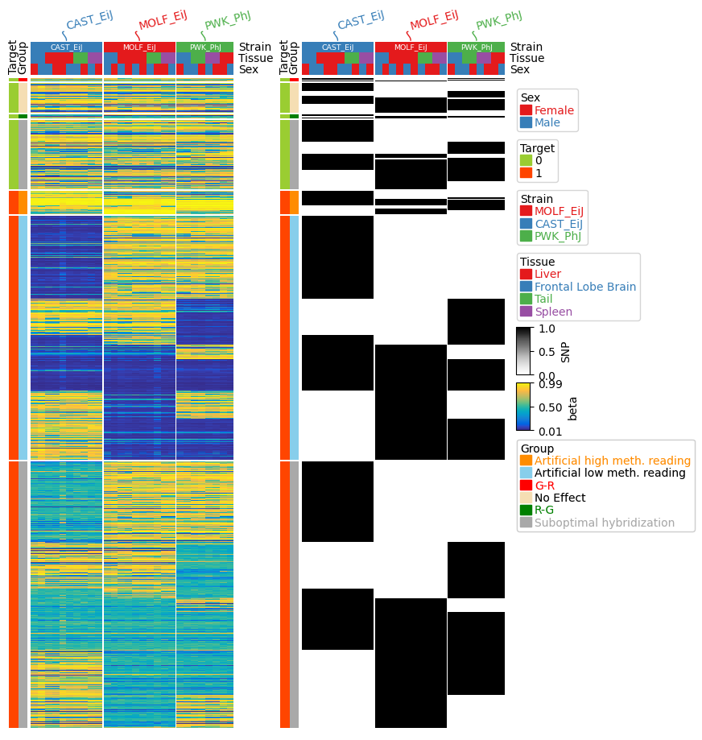

# PyComplexHeatmap
PyComplexHeatmap is a Python package to plot complex heatmap (clustermap). Please click [here](https://dingwb.github.io/PyComplexHeatmap) for documentation.

## Documentation:
[https://dingwb.github.io/PyComplexHeatmap](https://dingwb.github.io/PyComplexHeatmap) <br><br>
PYPI:
<br>
[https://pypi.org/project/PyComplexHeatmap/](https://pypi.org/project/PyComplexHeatmap/)
<br><br>
Libraries.io:
<br>
[https://libraries.io/pypi/PyComplexHeatmap](https://libraries.io/pypi/PyComplexHeatmap)

## Dependencies:
- matplotlib>=3.4.3
- numpy
- pandas
```
pip install --ignore-install matplotlib==3.5.1 numpy==1.20.3 pandas==1.4.1
```

## **Installation**
1. **Install using pip**:
```shell
pip install PyComplexHeatmap
#or
pip install --ignore-installed PyComplexHeatmap
```

2. **Install the developmental version directly from github**:
```
pip install git+https://github.com/DingWB/PyComplexHeatmap
```
if you have installed it previously and want to update it, please run 
`pip uninstall PyComplexHeatmap`
and install from github again
OR
```
git clone https://github.com/DingWB/PyComplexHeatmap
cd PyComplexHeatmap
python setup.py install
```

## **Usage**
### **1. Simple Guide To Get started.**
```
from PyComplexHeatmap import *

#Generate example dataset (random)
df = pd.DataFrame(['AAAA1'] * 5 + ['BBBBB2'] * 5, columns=['AB'])
df['CD'] = ['C'] * 3 + ['D'] * 3 + ['G'] * 4
df['EF'] = ['E'] * 6 + ['F'] * 2 + ['H'] * 2
df['F'] = np.random.normal(0, 1, 10)
df.index = ['sample' + str(i) for i in range(1, df.shape[0] + 1)]
df_box = pd.DataFrame(np.random.randn(10, 4), columns=['Gene' + str(i) for i in range(1, 5)])
df_box.index = ['sample' + str(i) for i in range(1, df_box.shape[0] + 1)]
df_bar = pd.DataFrame(np.random.uniform(0, 10, (10, 2)), columns=['TMB1', 'TMB2'])
df_bar.index = ['sample' + str(i) for i in range(1, df_box.shape[0] + 1)]
df_scatter = pd.DataFrame(np.random.uniform(0, 10, 10), columns=['Scatter'])
df_scatter.index = ['sample' + str(i) for i in range(1, df_box.shape[0] + 1)]
df_heatmap = pd.DataFrame(np.random.randn(30, 10), columns=['sample' + str(i) for i in range(1, 11)])
df_heatmap.index = ["Fea" + str(i) for i in range(1, df_heatmap.shape[0] + 1)]
df_heatmap.iloc[1, 2] = np.nan

#Annotate the rows with average > 0.3
df_rows = df_heatmap.apply(lambda x:x.name if x.sample4 > 0.5 else None,axis=1)
df_rows=df_rows.to_frame(name='Selected')
df_rows['XY']=df_rows.index.to_series().apply(lambda x:'A' if int(x.replace('Fea',''))>=15 else 'B')

row_ha = HeatmapAnnotation(S4=anno_simple(df_heatmap.sample4.apply(lambda x:round(x,2)),
                                           add_text=True,height=10,
                                           text_kws={'rotation':0,'fontsize':10,'color':'black'}),
                           # Scatter=anno_scatterplot(df_heatmap.sample4.apply(lambda x:round(x,2)),
                           #                  height=10),
                           Test=anno_barplot(df_heatmap.sample4.apply(lambda x:round(x,2)),
                                            height=18,cmap='rainbow'),
                           selected=anno_label(df_rows,colors='red'),
                           axis=0,verbose=0)

col_ha = HeatmapAnnotation(label=anno_label(df.AB, merge=True,rotation=15),
                           AB=anno_simple(df.AB,add_text=True),axis=1,
                           CD=anno_simple(df.CD,add_text=True),
                           EF=anno_simple(df.EF,add_text=True,
                                            legend_kws={'frameon':False}),
                           Exp=anno_boxplot(df_box, cmap='turbo'),
                           verbose=0) #verbose=0 will turn off the log.

plt.figure(figsize=(6, 8))
cm = ClusterMapPlotter(data=df_heatmap, top_annotation=col_ha,right_annotation=row_ha,
                       col_split=df.AB,row_split=df_rows.XY, col_split_gap=0.5,row_split_gap=1,
                       col_cluster=False,row_cluster=False,
                       label='values',row_dendrogram=False,show_rownames=True,show_colnames=True,
                         tree_kws={'row_cmap': 'Set1'},verbose=0,legend_gap=7,
                       annot=True,linewidths=0.05,linecolor='gold',cmap='turbo',
                      xticklabels_kws={'labelrotation':-45,'labelcolor':'blue'})
plt.show()
```
### Example output






## **More Examples**
[https://github.com/DingWB/PyComplexHeatmap/blob/main/notebooks/clustermap.ipynb](https://github.com/DingWB/PyComplexHeatmap/blob/main/notebooks/clustermap.ipynb)
<br><br>
[https://github.com/DingWB/PyComplexHeatmap/blob/main/notebooks/advanced_usage.ipynb](https://github.com/DingWB/PyComplexHeatmap/blob/main/notebooks/advanced_usage.ipynb)
<br><br>
[https://dingwb.github.io/PyComplexHeatmap/build/html/dotHeatmap.html](https://dingwb.github.io/PyComplexHeatmap/build/html/notebooks/dotHeatmap.html#Add-parameter-hue-and-use-different-cmap-and-marker-for-different-groups)