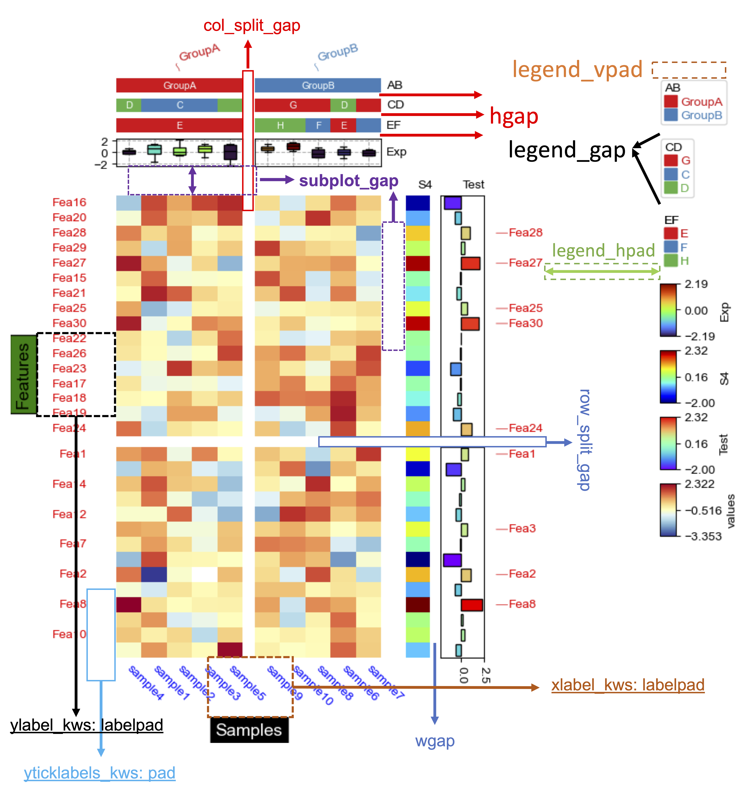
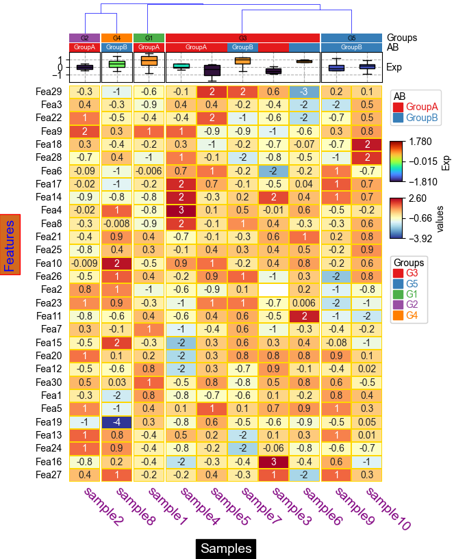
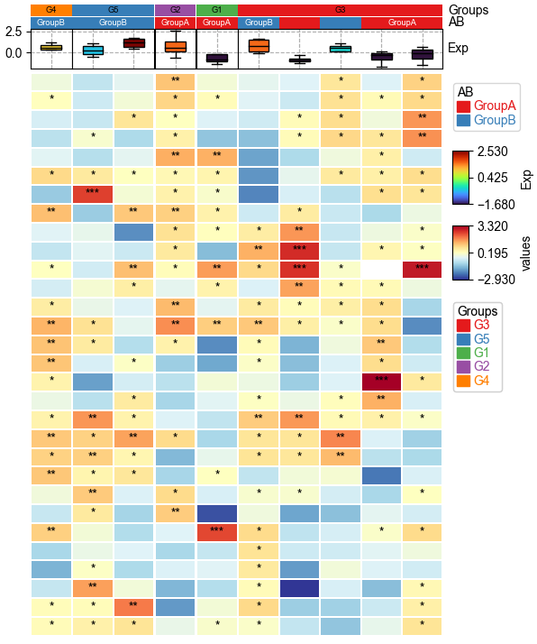

# PyComplexHeatmap [](https://pepy.tech/project/pycomplexheatmap) [](https://pepy.tech/project/pycomplexheatmap) [](https://pepy.tech/project/pycomplexheatmap)
PyComplexHeatmap is a Python package to plot complex heatmap (clustermap). Please click [here](https://dingwb.github.io/PyComplexHeatmap) for documentation.

## Documentation:
----------------------
[https://dingwb.github.io/PyComplexHeatmap](https://dingwb.github.io/PyComplexHeatmap)
<br><br>
[PYPI](https://pypi.org/project/PyComplexHeatmap/)
<br>

### Wiki
[wiki/layout](../../wiki/Layout/)
<br>
[wiki/Parameters](../../wiki/Parameters/)
<br>
[wiki/Features](../../wiki/Features/)

## Dependencies:
----------------------
- matplotlib>=3.3.1
- numpy
- pandas
- scipy
- fastcluster
```
pip install --ignore-install matplotlib numpy pandas fastcluster
```

## Citation
Ding, W., Goldberg, D. and Zhou, W. (2023), PyComplexHeatmap: A Python package to visualize multimodal genomics data. iMeta e115. https://doi.org/10.1002/imt2.115
<br>
**DOI**: [10.1002/imt2.115](https://onlinelibrary.wiley.com/doi/10.1002/imt2.115)
<br>
**PMID**: [38454967](https://pubmed.ncbi.nlm.nih.gov/38454967/)

## **Installation**
----------------------
1. **Install using pip**:
```shell
pip install PyComplexHeatmap

#upgrade from older version
pip install --upgrade PyComplexHeatmap
```

2. **Install the developmental version directly from github**:
```shell
pip install git+https://github.com/DingWB/PyComplexHeatmap
# reinstall
pip uninstall -y PyComplexHeatmap && pip install git+https://github.com/DingWB/PyComplexHeatmap
```
OR
```shell
git clone https://github.com/DingWB/PyComplexHeatmap
cd PyComplexHeatmap
python setup.py install
```

## [**Usage**](https://dingwb.github.io/PyComplexHeatmap)
----------------------
### [Simple Guide To Get started](https://dingwb.github.io/PyComplexHeatmap/build/html/notebooks/get_started.html)
### Example output
Click picture to view the source code

<table>
    <tr style="height: 500px">
        <td style="width:33%; background-color:white;text-align:center; vertical-align:middle">
            <a href="https://dingwb.github.io/PyComplexHeatmap/build/html/notebooks/kwargs.html#Control-gap-&-pad-in-heatmap">
                
            </a>
        </td>
        <td style="width:33%; background-color:white;text-align:center; vertical-align:middle">
            <a href="https://dingwb.github.io/PyComplexHeatmap/build/html/notebooks/kwargs.html#Modifying-xlabel-and-ylabel-using-xlabel_kws-and-ylabel_kws">
                
            </a>
        </td>
        <td style="width:33%; background-color:white;text-align:center; vertical-align:middle">
            <a href="https://dingwb.github.io/PyComplexHeatmap/build/html/notebooks/composite_heatmaps.html#Composite-two-heatmaps-horizontally-for-mouse-DNA-methylation-array-dataset">
                
            </a>
        </td>
    </tr>
    <tr style="height: 500px">
        <td style="width:33%; background-color:white;text-align:center; vertical-align:middle">
            <a href="https://dingwb.github.io/PyComplexHeatmap/build/html/notebooks/advanced_usage.html#Only-plot-the-annotations">
                
            </a>
        </td>
        <td style="width:33%; background-color:white;text-align:center; vertical-align:middle">
            <a href="https://dingwb.github.io/PyComplexHeatmap/build/html/notebooks/advanced_usage.html#Cluster-between-groups-and-cluster-within-groups">
                
            </a>
        </td>
        <td style="width:33%; background-color:white;text-align:center; vertical-align:middle">
            <a href="https://dingwb.github.io/PyComplexHeatmap/build/html/notebooks/single_cell_methylation.html">
                
            </a>
        </td>
    </tr>
    <tr style="height: 500px">
        <td style="width:33%; background-color:white;text-align:center; vertical-align:middle">
            <a href="https://dingwb.github.io/PyComplexHeatmap/build/html/notebooks/oncoPrint.html">
                
            </a>
        </td>
        <td style="width:33%; background-color:white;text-align:center; vertical-align:middle">
            <a href="https://dingwb.github.io/PyComplexHeatmap/build/html/notebooks/dotHeatmap.html#Visualize-up-to-five-dimension-data-using-DotClustermapPlotter">
                
            </a>
        </td>
        <td style="width:33%; background-color:white;text-align:center; vertical-align:middle">
            <a href="https://dingwb.github.io/PyComplexHeatmap/build/html/notebooks/oncoPrint2.html">
                
            </a>
        </td>
    </tr>
    <tr style="height: 500px">
        <td style="width:33%; background-color:white;text-align:center; vertical-align:middle">
            <a href="https://dingwb.github.io/PyComplexHeatmap/build/html/notebooks/cpg_modules.html#Plotting-the-Dot-clustermap">
                
            </a>
        </td>
        <td style="width:33%; background-color:white;text-align:center; vertical-align:middle">
            <a href="https://dingwb.github.io/PyComplexHeatmap/build/html/notebooks/advanced_usage.html#Custom-annotation">
                
            </a>
        </td>
        <td style="width:33%; background-color:white;text-align:center; vertical-align:middle">
            <a href="https://dingwb.github.io/PyComplexHeatmap/build/html/notebooks/gene_enrichment_analysis.html#Plot">
                
            </a>
        </td>
    </tr>
</table>

### [Advanced Usage](https://dingwb.github.io/PyComplexHeatmap/build/html/notebooks/advanced_usage.html)

### [Kwargs](https://dingwb.github.io/PyComplexHeatmap/build/html/kwargs.html)

## **More Examples**
[https://dingwb.github.io/PyComplexHeatmap/build/html/more_examples.html](https://dingwb.github.io/PyComplexHeatmap/build/html/more_examples.html)

## Call for Contributions
----------------------

The PyComplexHeatmap project welcomes your expertise and enthusiasm!

Small improvements or fixes are always appreciated. If you are considering larger contributions
to the source code, please contact us (ding.wu.bin.gm@gmail.com).

Writing code isn’t the only way to contribute to PyComplexHeatmap. You can also:
- review pull requests
- help us stay on top of new and old issues
- develop tutorials, presentations, and other educational materials
- maintain and improve [our website](https://dingwb.github.io/PyComplexHeatmap)
- develop graphic design for our brand assets and promotional materials
- translate website content
- help with outreach and onboard new contributors
- put forward some new ideas about update.
