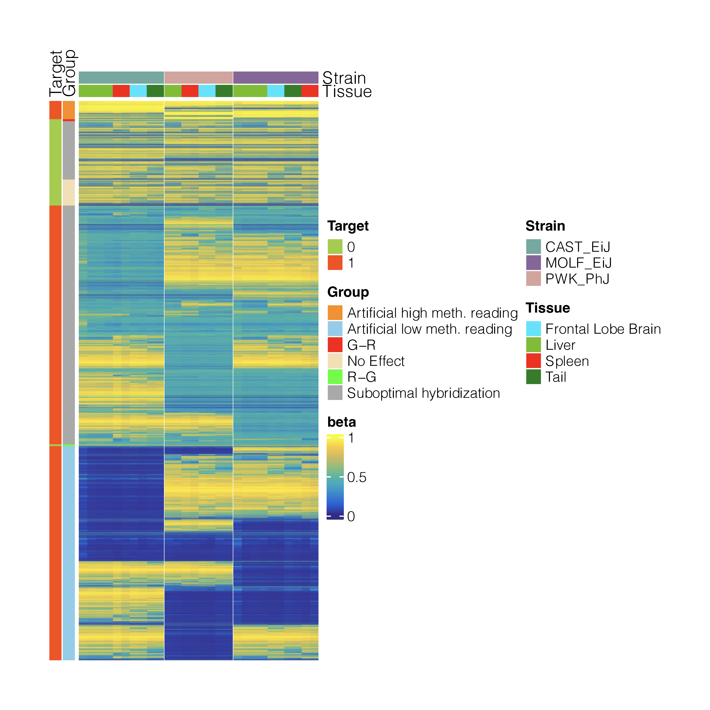
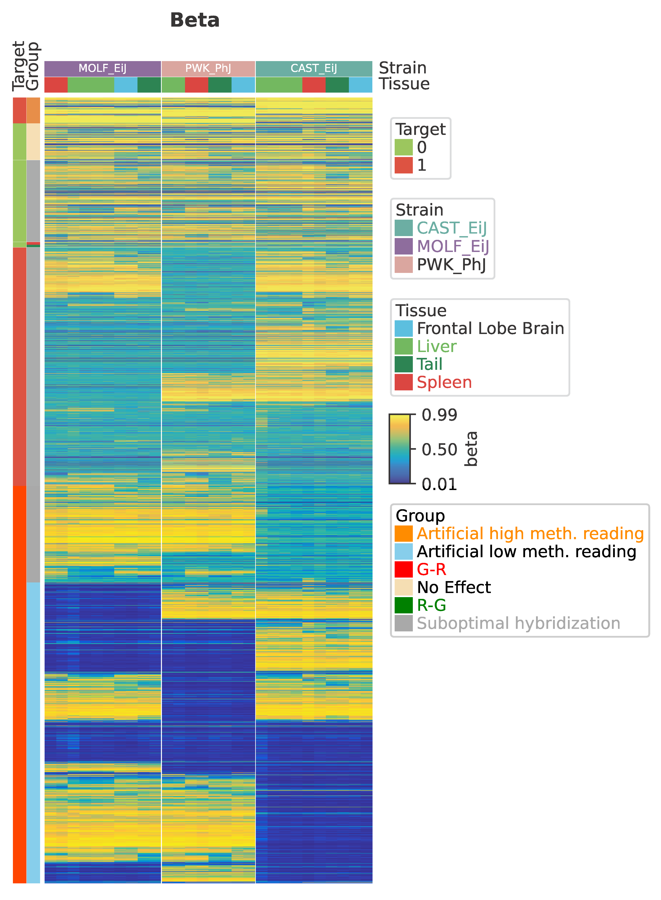

# Benchmark Dataset
We use the dataset obtained from PMID: 36617464 as test dataset to compare the performance between ComplexHeatmap and PyComplexHeatmap.
 
This dataset include 29,827 rows and 28 columns. Here, we generated the same heatmap using the same clustering method and metric to compare the processing time and memory usage between these two packages.

# Comparison Result
| Package Name     | Processing Time (s) | Memory (kb) |
| ---------------- | ------------------- | ----------- |
| ComplexHeatmap   | 38.33               | 3,706,592   |
| PyComplexHeatmap | 22.83               |   937,364   |

# Outputs
Click the header to view the source code, click the image to view the pdf.
<table>
    <tr>
        <th><a href="heatmap.R">ComplexHeatmap</a></th>
        <th><a href="heatmap.py">PyComplexHeatmap</a></th>
    </tr>
    <tr style="height: 600px">
        <td style="width:33%; background-color:white;text-align:center; vertical-align:middle">
            
        </td>
        <td style="width:33%; background-color:white;text-align:center; vertical-align:middle">
            
        </td>
    </tr>
</table>